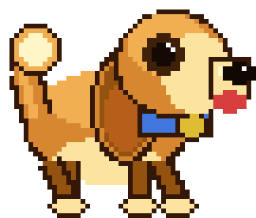

# Buddy: The Offline, AI-Powered Desktop Companion

<p align="center">
  
</p>

Buddy is a transparent, always-on-top virtual companion that lives directly on your Windows workspace. Designed as an offline-first desktop companion, Buddy reacts dynamically to your environment, chats with you, comments on your tasks, and plays interactive games—all powered by a local Large Language Model (LLM) running on your machine.

Unlike typical cloud-dependent widgets, Buddy performs all processing locally via [Ollama](https://ollama.com). Your files, screen contents, and conversations never leave your computer.

---

## 🎒 Active Skills & Behaviors

Buddy is equipped with modular, high-level skills that determine how he interacts with you and your desktop:

*   **🎾 Play & Fetch:** Triggered via the tray icon. You can drop a treat near Buddy, throw a bone across the screen for him to fetch, or spawn a bouncy ball that he chases, catches, and kicks around your screen.
*   **👁️ Multimodal Screen Vision:** When configured with a local vision model, Buddy can take a snapshot of your active display to comment in-character on whatever you are reading, designing, or coding.
*   **🌤️ Real-Time Weather Reactions:** Buddy checkswttr.in periodically for local forecasts, dynamically reacting to the weather outside with comments about rain, snow, heat, or cozy indoor weather.
*   **🤫 Meeting & Focus Courtesy:** Buddy reads your workspace processes. When you join a meeting (Zoom, Teams, Discord, etc.), he alerts you and falls asleep to stay quiet, waking up and wagging his tail when the meeting ends.
*   **☕ Health & Wellness Reminders:** If Buddy detects you coding or typing continuously for more than 45 minutes, he will nudge you in-character to take a break, stand up, or drink water.
*   **⛓️ Leash & Anchor Constraints:** Need Buddy to stay in a designated area of your screen? Trigger the chain leash from the tray icon to pin him to a draggable anchor. Buddy can wander freely within his leash radius but won't wander over your active applications.

---

## 🕹️ Controls & Interaction

Getting Buddy to play or setting up his parameters is completely visual:

*   **Left-Click + Drag:** Pick up Buddy and place him anywhere on your screen.
*   **Hold Left-Click (1s+):** Pet Buddy to make him happy (he wags his tail and wiggles with joy).
*   **Double-Click Buddy:** Opens a chat dialog to talk to him directly. Ask him questions, tell him about your day, or tell him to do tricks.
*   **Right-Click System Tray Icon:** This is where you activate Buddy's skills. Drop toys, throw bones, leash/unleash him, trigger an immediate screen-peek commentary, or open settings.

---

## ⚙️ Graphical Settings Window

No manual configuration editing is required. Right-clicking the system tray icon and selecting **Settings** opens a custom window where you can:

*   Change your owner nickname.
*   Enable/disable the AI chat backend and toggle sound effects.
*   Select from a live list of Ollama models pulled on your system (with manual override support).
*   Toggle screen vision on or off.
*   Check the real-time status of your local Ollama connection with a single-click refresh button.

---

## 🚀 Setup & Installation

### Option A: Installer (Easiest)
1. Download the latest installer `BuddySetup-x.y.z.exe` from the [Releases page](https://github.com/sumitkanchan4/desktop-pet/releases/latest).
2. The installation wizard will automatically:
    *   Verify whether [Ollama](https://ollama.com) is installed and active on your system.
    *   Prompt you to select a text model (defaulting to the lightweight `gemma3:1b`) and an optional vision model (defaulting to `moondream`).
    *   Download and configure the models.
3. Launch Buddy from your desktop shortcut or start menu.

### Option B: Build and Run from Source
If you want to run Buddy in a development environment:

```powershell
# 1. Clone the repository
git clone https://github.com/sumitkanchan4/desktop-pet.git
cd desktop-pet

# 2. Configure a virtual environment
python -m venv .venv
.\.venv\Scripts\Activate.ps1

# 3. Install requirements
pip install -r requirements.txt

# 4. Pull required models via Ollama
ollama pull gemma3:1b        # For text chats and commentary (~700MB)
ollama pull moondream        # For screen vision peeking (~1.7GB, optional)

# 5. Run the application
python main.py
```

### Option C: Build the Setup Executable
To package the project yourself, compile the binaries using PyInstaller and Inno Setup 6:
```powershell
.\build\build.ps1 -Installer -Version 0.1.0
```
The output setup file will be saved in `build\Output\BuddySetup-0.1.0.exe`.

---

## 🔒 Privacy & Safety

*   **Offline Processing:** Chat text, screen peeks, and active process tracking are executed entirely on your CPU/GPU via Ollama. No personal workspace statistics or text entries are uploaded to external APIs.
*   **System Integrity:** Screen-peeks are processed directly in system memory and passed to Ollama. They are never cached to disk or saved in local directories.
*   **Telemetry:** Buddy does not collect crash telemetry or analytics. All logs remain local on your machine.

---

## 📄 License & Attribution

This project is open-source under the [MIT License](LICENSE). 

Special thanks to:
*   [Ollama](https://ollama.com) for local model execution.
*   [Pillow](https://pillow.readthedocs.io/) for procedural sprite rasterization.
*   [PyQt6](https://www.riverbankcomputing.com/software/pyqt/) for the window rendering layer.
